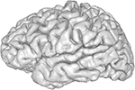
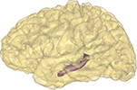
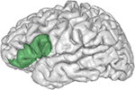
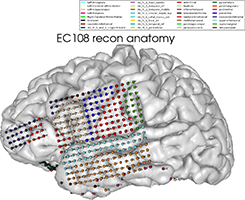
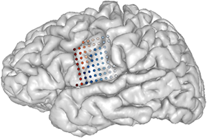
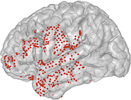

##  img_pipe: Image processing pipeline for ECoG data  ##

[](https://travis-ci.org/ChangLabUcsf/img_pipe) [](https://badge.fury.io/py/img-pipe) [](https://doi.org/10.5281/zenodo.996814)

Developed by Liberty Hamilton, David Chang, Morgan Lee at the Laboratory of Dr. Edward Chang, UC San Francisco
http://changlab.ucsf.edu

Email: edward.chang@ucsf.edu or liberty.hamilton@austin.utexas.edu with questions.

This contains the imaging pipeline as one importable python class for running a patient's
brain surface reconstruction and electrode localization/labeling.

The full capabilities of the pipeline are described in the paper: 
Hamilton LS, Chang DL, Lee MB, Chang EF (2017). [Semi-automated anatomical labeling and inter-subject warping of high-density intracranial recording electrodes in electrocorticography.](https://doi.org/10.3389/fninf.2017.00062) **Frontiers in Neuroinformatics** 11(62).

[Sample data is available on Zenodo](https://doi.org/10.5281/zenodo.996814), including an AC-PC aligned T1 scan, CT scan, and all intermediate and final files from the img_pipe processing pipeline.

## About ##
`img_pipe` is an open source python package for preprocessing of imaging data for use in intracranial electrocorticography (ECoG) and intracranial stereo-EEG analyses. This python package aims to provide a standardized interface for electrode localization, labeling, and warping to an atlas, as well as code to plot and display results on 3D cortical surface meshes. It gives the user an easy interface to create anatomically labeled electrodes that can also be warped to an atlas brain, starting with only a preoperative T1 MRI scan and a postoperative CT scan. 

Example results are shown below in the native subject space (left) and in the cvs_avg35_inMNI152 atlas space (right):


## Setup and Installation ##

To download this package, you will need:
* a MacOS or Linux machine (if you are using Windows, download a Linux Virtual Machine to use this package)
* __anaconda__ for Python version 2.7 or 3 (https://www.continuum.io/downloads)<br>
* __Freesurfer__ (https://surfer.nmr.mgh.harvard.edu/fswiki/DownloadAndInstall) version 5.3.0 or higher

After you download and install those dependencies, run the following commands in your terminal if using Python 2.7:

``` 
$ git clone https://github.com/changlabucsf/img_pipe
$ conda env create -f img_pipe/environment_py27.yml
$ source activate img_pipe_py2
$ ipython
$ import img_pipe
 ```

The following instructions should be used if you wish to work in Python 3:

```
$ git clone https://github.com/changlabucsf/img_pipe
$ conda env create -f img_pipe/environment_py35.yml
$ source activate img_pipe_py3
$ ipython
$ from img_pipe import img_pipe
```

After that, edit your ~/.bash_profile or ~/.bashrc and set the following environment variables with these lines:

```
export SUBJECTS_DIR=/path/to/freesurfer/subjects
export FREESURFER_HOME=/path/to/freesurfer/
source $FREESURFER_HOME/SetUpFreeSurfer.sh
```
Note that you can set `SUBJECTS_DIR` to wherever you want to place your subjects' imaging data - for example, `/Applications/freesurfer/subjects`.

Then in terminal, run `source ~/.bash_profile` or `source ~/.bashrc` to activate these environment variables.

To run `img_pipe`, you will need a high quality non-contrast T1 scan and a non-contrast CT scan. The T1 scan should ideally be 
AC-PC aligned before you start. Name the T1 scan T1.nii and place in `$SUBJECTS_DIR/your_subj/acpc`.  Name the CT scan CT.nii 
and place in `$SUBJECTS_DIR/your_subj/CT`.


You should now be able to import img_pipe from python. 
```python
>>> import img_pipe # Or in python 3, from img_pipe import img_pipe
>>> patient = img_pipe.freeCoG(subj='subject_name', hem='lh')
>>> patient.prep_recon()
>>> patient.get_recon()
```

If you have completed all of the steps, you can plot the brain with anatomically-labeled electrodes as follows:
```python
>>> import img_pipe
>>> patient = img_pipe.freeCoG(subj='subject_name', hem='lh')
>>> patient.plot_recon_anatomy()
```

Or just the brain with
```python
>>> patient.plot_brain()
```

The full workflow is shown as a flowchart below:


### Example images: ###
In addition to localization, labeling, and warping of electrodes, `img_pipe` includes some nice plotting functions for visualizing your data.  You can plot cortical and subcortical ROIs with different surface properties (opacity, color, specularity, etc) and you can plot electrodes either as spheres or as gaussian blobs on the cortical surface. Electrodes can be colored individually or all the same color. If you prefer to work in 2D (using matplotlib), there is a function `patient.auto_2D_brain()` that will create a brain image and corresponding projected 2D coordinates for even more flexibility (and some added speed since it avoids 3D rendering).

All of these images should be created after initializing the patient (as below).
```python
>>> import img_pipe
>>> patient = img_pipe.freeCoG(subj='subj_ID', hem='lh')
```

<table>
<tr>
<th width=300px>
Image
</th>
<th width=300px>
 Code
</th>
</tr>
<tr>
<td width=300px align="center">
 
</td>
<td width=300px>
   <pre lang="python">
patient.plot_brain() 
   </pre>
</td>
</tr>
<tr>
<td align="center">
 
</td>
<td>
   <pre lang="python">
pial = patient.roi('pial',opacity=0.3, representation='surface',
                   color=(0.9,0.8,0.5),gaussian=False)
hipp = patient.roi('lHipp', opacity = 0.8, representation = 'wireframe', 
                   color=(0.5, 0.3,0.5), gaussian=False) 
patient.plot_brain(rois=[pial, hipp])
   </pre>
</td>
</tr>
<tr>
<td align="center">
 
</td>
<td>
   <pre lang="python">
roi_list = ['parsopercularis','parstriangularis','parsorbitalis']
patient.make_roi_mesh('pars',roi_list, showfig=False)
patient.plot_brain(rois=[patient.roi('pial',opacity=1.0),
                   patient.roi('lh_pars',color=(0.3,0.6,0.4))], 
                   screenshot=True, showfig=False)
   </pre>
</td>
</tr>
<tr>
<td align="center">
 
</td>
<td>
   <pre lang="python">
patient.plot_recon_anatomy()
   </pre>
</td>
</tr>
<tr>
<td align="center">
 
</td>
<td>
   <pre lang="python">
from plotting.ctmr_brain_plot import ctmr_gauss_plot
from plotting.ctmr_brain_plot import el_add
from matplotlib import cm
from matplotlib import pyplot as plt
patient = img_pipe.freeCoG(subj='EC108', hem='lh', subj_dir=subj_dir)
precentral_elecs = patient.get_elecs(roi='precentral')['elecmatrix']
postcentral_elecs = patient.get_elecs(roi='postcentral')['elecmatrix']
pial = patient.get_surf(hem='lh')
cmap = cm.Reds
precentral_colors = cmap(np.linspace(0,1,precentral_elecs.shape[0]))[:,:3]
cmap = cm.Blues
postcentral_colors = cmap(np.linspace(0,1,postcentral_elecs.shape[0]))[:,:3]
mesh, mlab = ctmr_gauss_plot(tri=pial['tri'], vert=pial['vert'])
el_add(precentral_elecs, color = precentral_colors)
el_add(postcentral_elecs, color = postcentral_colors)
   </pre>
</td>
</tr>
<tr>
<td align="center">
 
</td>
<td>
   <pre lang="python">
subjs = ['EC108','EC125']
elecs = []

#get the electrode coordinate matrix for each subject
for s in subjs:
&nbsp;&nbsp;&nbsp;&nbsp;print s
&nbsp;&nbsp;&nbsp;&nbsp;patient = img_pipe.freeCoG(subj = s, hem = 'lh')
&nbsp;&nbsp;&nbsp;&nbsp;warped_elecs = patient.get_elecs(elecfile_prefix='TDT_elecs_all_warped')
&nbsp;&nbsp;&nbsp;&nbsp;elecs.append(warped_elecs['elecmatrix'])
#combine the electrode matrices from the different subjects into one matrix
elecmatrix = np.concatenate(elecs, axis=0)
#simply pass in the elecmatrix to plot_brain()
template = 'cvs_avg35_inMNI152'
atlas_patient = img_pipe.freeCoG(subj = template, hem='lh')
roi = atlas_patient.roi('pial', opacity=0.5)
atlas_patient.plot_brain(rois = [roi], 
&nbsp;&nbsp;&nbsp;&nbsp;&nbsp;&nbsp;&nbsp;&nbsp;showfig=True, 
&nbsp;&nbsp;&nbsp;&nbsp;&nbsp;&nbsp;&nbsp;&nbsp;screenshot=True, 
&nbsp;&nbsp;&nbsp;&nbsp;&nbsp;&nbsp;&nbsp;&nbsp;elecs = elecmatrix,
&nbsp;&nbsp;&nbsp;&nbsp;&nbsp;&nbsp;&nbsp;&nbsp;weights = None)
   </pre>
</td>
</tr>
</table>

If you find any bugs, please post in the Issues tab. 
